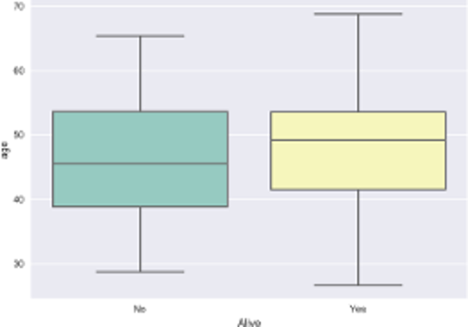

# Insights into the I-SPY clinical trial
#### by Julio Cardenas-Rodriguez (@jdatascientist)

## 1. Description and Objectives
The goal of this project is to improve the prediction of clinical outcomes to neoadjuvant chemotherapy in patients with breast cancer. Currently, most patients with breast cancer undergo neoadjuvant chemotherapy, which is aimed at reducing the size of a tumor (burden) before surgery to remove the tumor or the entire breast.   
Some of the patients response completely to the therapy and the patient does not present any residual tumor at the time of surgery (Pathologic complete response or `PCR`). On the other hand, most patients have residual disease at the time of surgery and further treatment or surgery is required.

## 2. Data source
All data for the **222 patients** treated for breast cancer in the IPSY-1 clinical trial was obtained from the [cancer imaging archive](https://wiki.cancerimagingarchive.net/display/Public/ISPY1) and the Breast Imaging Research Program at UCSF. To facilitate the dissemination and reproducibility of this analysis, the raw data and all code were posted at [Data.World](https://data.world/julio/ispy-1-trial) and [Github](https://github.com/JCardenasRdz/Insights-into-the-I-SPY-clinical-trial) and are available under an MIT license.

## 3. Source code in Python and data analysis
The code is organized in a Python package (`ispy1`), with modules for each of the four steps of the data analysis

> - ispy1
>   - clean_data.py
>   - inferential_statistics.py
>   - predictive_statistics.py
>   - survival_analysis.py

## 4. Description of the data
> The data contained in the cancer imaging archive is organized column-wise for all subjects as follows (rows = patients).

**Clinical Outcomes**
1. Survival Status at the end of the study (`Survival`):
    - 7 = Alive
    - 8 = Dead
    - 9 = Lost to follow up
2. Length of Survival (`Survival_length`):
    - Days from study entry to death or last follow-up
3. Recurrence-free survival (`RFS`):
    - days from from NCAC start until progression or death
4. Recurrence-free survival indicator (`RFS_code`)
    - progression or death (1),
    - removed from survival curve (0)
5. Pathologic Complete Response (`PCR`) post-neoadjuvant ?:
    - 1 = Yes
    - 0 = No
    - Lost (Blank)
6. Residual Cancer Burden class (`RCB`):
    - 0 = RCB index (Class 0)
    - 1 = RCB index less than or equal to 1.36 (Class I)
    - 2 = RCB index greater than 1.36 or equal to 3.28  (Class II)
    - 3 = III, RCB index greater than 3.28 (Class III)
    - Blank = unavailable or no surgery

**Predictors of clinical outcomes**
1. `Age` (Years)
2. `Race`, encoded as:
    - 1 = Caucasian
    - 3 = African American
    - 4 = Asian
    - 5 = Native Hawaiian
    - 6 = American Indian
    - 50 = Multiple race
3. Estrogen Receptor Status (`ER+`) encoded as:
    - 1 = Positive
    - 0 = Negative
    - Blank = Indeterminate
4. Progesterone Receptor Status (`PR+`) encoded as:
    - 1 = Positive
    - 0 = Negative
    - Blank = Indeterminate
5. Hormone Receptor Status (`ER+`)
    - 1 = Positive
    - 0 = Negative
    - Blank = Indeterminate
6. Bilateral Breast Cancer (`Bilateral`):
    - 1 = Cancer Detected on both breasts
    - 0 = Cancer Detected in a single breast
7. Breast with major or single Tumor (`Laterality`):
    - 1 = Left breast
    - 2 = Right breast
8. Largest tumor dimension at Baseline estimated by MRI (`MRI_LD_Baseline`, continous variable)
9. Largest tumor dimension 1-3 days after NAC estimated by MRI (`MRI_LD_1_3dAC`, continous variable)
10. Largest tumor dimension between cycles of NAC estimated by MRI (`MRI_LD_Int_Reg`, continous variable)
11. Largest tumor dimension before surgery estimated by MRI (`MRI_LD_PreSurg`, continous variable)

## Data cleaning and organizing
The data for this study was provided as an excel file (.xls) with multiple fields and is not suitable to construct the contingency tables required for inferential statistics or to peform predictive statistics using `sklearn` and `statsmodels`. The module `clean_data` of the `ipsy1` was used to clean the data and generate a pandas dataframe. The code for  `clean_data` module can be found [here](https://gist.github.com/JCardenasRdz/75dd152afe6250a5c7de2315b2a2a960).  

```Python
# load module by Julio and pandas
from ispy1 import clean_data
import pandas as pd

file = './data/I-SPY_1_All_Patient_Clinical_and_Outcome_Data.xlsx'
df = clean_data.clean_my_data(file)
df.head(2)

# save clean data in new  csv file
df.to_csv('./data/I-SPY_1_clean_data.csv')
df.head(2)
```


## Inferential Statistics
The objective of inferential statistics is to estimate information about populations and test if two (or more) populations are statistically the same. The analysis for this project is organized according to the type of predictors ( categorical or continous) and their effect on categorical outcomes.
- Load data

```Python
# standard modules
import seaborn as sns
import pandas as pd
import matplotlib.pyplot as plt

# module wrote by julio
from ispy1 import inferential_statistics
df = pd.read_csv('./data/I-SPY_1_clean_data.csv')
```
1. Inferential_statistics: Categorical vs Categorical (Chi-2 test)   

The first thing needed to perform this kind of analysis is to construct contingency tables to establish the frequency of observations for each category being studied for example:

```Python
>>> inferential_statistics.contingency_table('PCR', 'ER+',df)
ER+   Yes    No
PCR            
Yes  17.0  28.0
No   81.0  42.0
```
Now, we can perform the chi-2 test to the effect of multiple categorical predictors on `PCR`:

- Effect of categorical predictors on Pathological complete response (`PCR`)
```Python
>>> predictors = ['White', 'ER+', 'PR+', 'HR+','Right_Breast']
>>> outcome = 'PCR'
>>> inferential_statistics.categorical_data(outcome, predictors, df)
               p-value  Relative_Risk   RR_lb   RR_ub
White         0.833629         0.8878  0.5076  1.5528
ER+           0.001988         0.4337  0.2582  0.7285
PR+           0.000198         0.3219  0.1707  0.6069
HR+           0.000307         0.3831  0.2286  0.6422
Right_Breast  0.851883         1.0965  0.6649  1.8080
```

These results indicate that because `ER+`,`PR+`, and `HR+` show a p-value < 0.05 we reject the null hypothesis of indepedence and conclude that `PCR` is not independent from `ER+`,`PR+`, and `HR+`. Furthermore, the relative risk indicates that `ER+`,`PR+`, and `HR+` are associate with reduce probability of `PCR`, in other words, being positive for these markers reduce the chances of responding to the NAC.

- Effect of categorical predictors on Pathological complete response (`Alive`)
```Python
>>> outcome = 'Alive'
>>> inferential_statistics.categorical_data(outcome, predictors, df)
               p-value  Relative_Risk   RR_lb   RR_ub
White         0.439359         1.0935  0.9032  1.3239
ER+           0.001135         1.3095  1.1025  1.5554
PR+           0.162557         1.1266  0.9739  1.3031
HR+           0.038917         1.1950  1.0094  1.4148
Right_Breast  0.729139         0.9602  0.8287  1.1125
```

These results indicate that because `ER+`,and `HR+` have a mild effect on the chances of survival (p-value < 0.5), but they relative risk indicates that the effect is very close to 1.0, meaning that being `ER+` or `HER+` has little effect on survival according to the chi-2 test, a complete survival analysis is performed in section 3.0.   


2. Inferential_statistics: Continous vs Categorical (ANOVA)   

An analysis using continous predictors for a categorical outcome requires using analysis of variance (ANOVA). I implemented this technique in the `inferential_statistics` module of `isp1`.

- Effect of Age on PCR

```Python
>>> predictor= ['age']
>>> outcome = 'PCR'
>>> anova_table, OLS = inferential_statistics.linear_models(df, outcome, predictor);
---------------------------------------------
             sum_sq     df         F    PR(>F)
age        0.256505    1.0  1.302539  0.255394
Residual  32.689923  166.0       NaN       NaN
---------------------------------------------
```
Age clearly does not have an effect (is associated) with PCR. The effect so small that we can even conclude this just by looking at a grouped histogram:  
```Python
>>> sns.boxplot(x= outcome, y=predictor[0], data=df, palette="Set3");
>>> plt.show()
```


- Effect of `Age` on survival (`Alive`)

The ANOVA for this interaction indicates that `Age` has an effect on survival (`Alive`). It technically would bot be significant at the 95% confidence level (p-value = 0.06), but it would at the 94% confidence level.

```Python
>>> predictor= ['age']
>>> outcome = 'Alive'
>>> anova_table, OLS = inferential_statistics.linear_models(df, outcome, predictor);
---------------------------------------------
             sum_sq     df         F    PR(>F)
age        0.062227    1.0  0.399719  0.528104
Residual  25.842534  166.0       NaN       NaN
---------------------------------------------
```

A simple boxplot shows that older patients are less likely to be `Alive` by the end of this study.

```Python
>>> sns.boxplot(x= outcome, y=predictor[0], data=df, palette="Set3");
<matplotlib.axes._subplots.AxesSubplot object at 0x111aff080>
>>> plt.show()
```


- Explore interactions between age, survival, and PCR

A very interesting fact about NAC and `PCR`, is that not all paitents who achieve `PCR` survival until the end of the study.

```Python
>>> inferential_statistics.contingency_table('PCR', 'Alive',df)
Alive   Yes    No
PCR              
Yes    41.0   4.0
No     95.0  28.0
```
